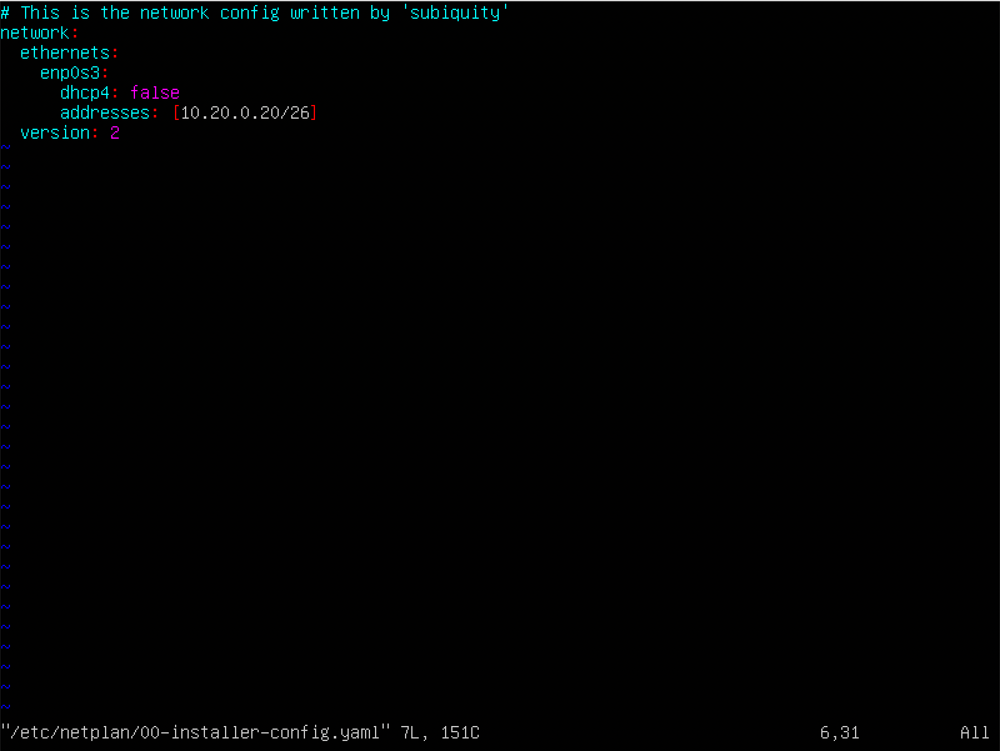
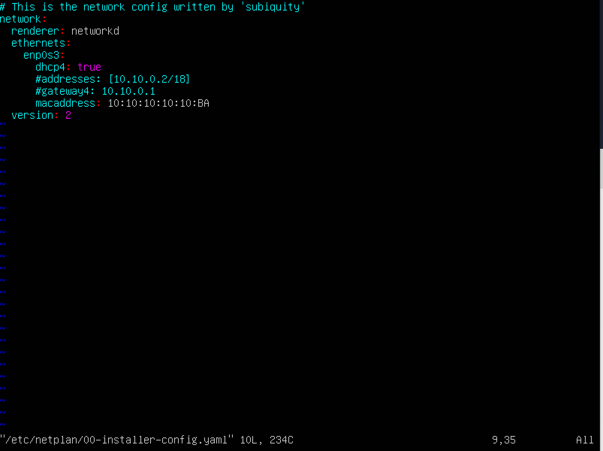
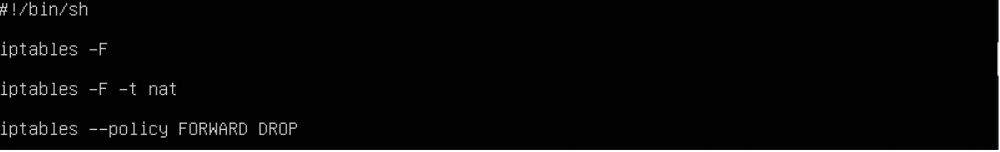

## Part 1. Инструмент ipcalc

### 1.1. Сети и маски

Определить и записать в отчет:

1) Адрес сети 
    - 192.167.38.54/13
        - 192.160.0.0

2) Перевод маски:
    - 255.255.255.0:
        - префиксная запись: /24
        - двоичная запись: 11111111.11111111.11111111.00000000
    - /15:
        - обычная запись: 255.254.0.0
        - двоичная запись: 11111111.11111111.00000000.00000000
    - 11111111.11111111.11111111.11110000
        - обычная запись: 255.255.255.240
        - префиксная запись: /28

3) Минимальный и максимальный хост в сети 12.167.38.4 при масках:
    - /8: 
        - Мин. хост: 12.0.0.1
        - Макс. хост: 12.255.255.254
    - 11111111.11111111.00000000.00000000: 
        - Мин. хост: 12.167.0.1
        - Макс. хост: 12.167.255.254
    - 255.255.254.0: 
        - Мин. хост: 12.167.38.1
        - Макс. хост: 12.167.39.254
    - /4: 
        - Мин. хост: 0.0.0.1
        - Макс. хост: 15.255.255.254

### 1.2. localhost

Определить и записать в отчёт, можно ли обратиться к приложению, работающему на localhost, со следующими IP:

1) 194.34.23.100: нет
2) 127.0.0.2: да
3) 127.1.0.1: да
4) 128.0.0.1: нет

### 1.3. Диапазоны и сегменты сетей

Определить и записать в отчёт:

1) Какие из перечисленных ip можно использовать в качестве публичных, а какие в качестве частных:
    - 10.0.0.45: приватный
    - 134.43.0.2:  публичный
    - 192.168.4.2: приватный
    - 172.20.250.4: приватный
    - 172.0.2.1: публичный
    - 192.172.0.1: публичный
    - 172.68.0.2: публичный
    - 172.16.255.255: приватный
    - 10.10.10.10: приватный
    - 192.169.168.1: публичный

2) Какие из перечисленных IP адресов шлюза возможны у сети 10.10.0.0/18:
    - 10.0.0.1: нет
    - 10.10.0.2: да
    - 10.10.10.10: да
    - 10.10.100.1: нет
    - 10.10.1.255: нет

## Part 2. Статическая маршрутизация между двумя машинами

С помощью команды ip a посмотреть посмотреть сущшествующие сетевые интерфейсы:

>Существующие интерфейсы у ws1

>Существующие интерфейсы у ws2

Описать сетевой интерфейс, соответствующий внутренней сети, на обеих машинах и задать следующие адреса и маски: ws1 - 192.168.100.10, маска /16, ws2 - 172.24.116.8, маска /12

>Описываем сетевой интерфейс, соответствующий внутренней сети на ws1

>Описываем сетевой интерфейс, соответствующий внутренней сети на ws2

Выполнить команду netplan apply для перезапуска сервиса сети

>Перезапускаем сервис с помощью netplan apply на ws1

>Перезапускаем сервис с помощью netplan apply на ws2

### 2.1. Добавление статического маршрута вручную

Добавить статический маршрут от одной машины до другой и обратно при помощи команды вида ip r add и пропинговать соединение между машинами.

>Добавляем статистический маршрут при помощи ip r add на ws1

>Добавляем статистический маршрут при помощи ip r add на ws2

### 2.2. Добавление статического маршрута с сохранением

Добавить статический маршрут от одной машины до другой с помощью файла etc/netplan/00-installer-config.yaml

>Добавляем статический маршрут на ws1

>Добавляем статический маршрут на ws2

Пропинговать соединение между машинами

>Пингуем соединения на ws1

>Пингуем соединения на ws2

## Part 3. Утилита iperf3

### 3.1. Скорость соединения

1) Перевести и записать в отчёт:
- 8 Mbps в MB/s: 1 MB/s
- 100 MB/s в Kbps: 819200 Kbps
- 1 Gbps в Mbps: 1024 Mbps

### 3.2. Утилита iperf3

>Измеряем скорость соединения 

>Измеряем скорость соединения

## Part 4. Сетевой экран

### 4.1. Утилита iptables

Создать файл /etc/firewall.sh, имитирующий фаерволл

1) на ws1 применить стратегию когда в начале пишется запрещающее правило, а в конце пишется разрешающее правило (это касается пунктов 4 и 5)
2) на ws2 применить стратегию когда в начале пишется разрешающее правило, а в конце пишется запрещающее правило (это касается пунктов 4 и 5)
3) открыть на машинах доступ для порта 22 (ssh) и порта 80 (http)
4) запретить *echo reply* (машина не должна "пинговаться”, т.е. должна быть блокировка на OUTPUT)
5) разрешить *echo reply* (машина должна "пинговаться")

>Firewall с нужными правилами на ws1

>Firewall с нужными правилами на ws2

Запустить файлы на обеих машинах командами chmod +x /etc/firewall.sh и /etc/firewall.sh

>Запуск файла на ws1

>Запуск файла на ws2

- Разница в том, что если запрещающее правило стоит первым, то следующее разврешающее правило не будет работать

### 4.2. Утилита nmap

Командой ping найти машину, которая не "пингуется", после чего утилитой nmap показать, что хост машины запущен

>Командой ping нашли машину, которая не пингуется и показали nmap, что хост запущен

## Part 5. Статическая маршрутизация сети
### 5.1. Настройка адресов машин

1) Настроить конфигурации машин в etc/netplan/00-installer-config.yaml согласно сети на рисунке.

>Настроили конфигурацию машины ws11

>Настроили конфигурацию машины ws21

>Настроили конфигурацию машины ws22

>Настроили конфигурацию машины r1

>Настроили конфигурацию машины r2

2) Перезапустить сервис сети. Если ошибок нет, то командой ip -4 a проверить, что адрес машины задан верно. Также пропинговать ws22 с ws21. Аналогично пропинговать r1 с ws11.

>Проверяем, что адрес машины ws11 задан верно

>Проверяем, что адрес машины ws21 задан верно и пингуем с ws21

>Проверяем, что адрес машины ws22 задан верно

>Проверяем, что адрес машины r1 задан верно и пингуем с ws11

>Проверяем, что адрес машины r1 задан верно

### 5.2. Включение переадресации IP-адресов.

1) Для включения переадресации IP, выполнить команду на роутерах:
`sysctl -w net.ipv4.ip_forward=1` 

>Включаем переадресацию на r1

>Включаем переадресацию на r2

Откройте файл /etc/sysctl.conf и добавьте в него следующую строку:
`net.ipv4.ip_forward = 1`

>Добавили `net.ipv4.ip_forward = 1` на r1

>Добавили `net.ipv4.ip_forward = 1` на r2

### 5.3. Установка маршрута по-умолчанию

1) Настроить маршрут по-умолчанию (шлюз) для рабочих станций. Для этого добавить gateway4 [ip роутера] в файле конфигураций

>Настройка маршрута по-умолчания на ws11

>Настройка маршрута по-умолчания на ws21

>Настройка маршрута по-умолчания на ws22

2) Вызвать ip r и показать, что добавился маршрут в таблицу маршрутизации

>Вызов ip r на ws11

>Вызов ip r на ws21

>Вызов ip r на ws22

3) Пропинговать с ws11 роутер r2 и показать на r2, что пинг доходит. Для этого использовать команду:
`tcpdump -tn -i eth1`

>Пингуем с ws11 роутер r2

>Показываем, что пинг доходит

### 5.4. Добавление статических маршрутов

1) Добавить в роутеры r1 и r2 статические маршруты в файле конфигураций

>Добавили в роутер r1 статический маршрут

>Добавили в роутер r2 статический маршрут

2) Вызвать ip r и показать таблицы с маршрутами на обоих роутерах

> Таблица с маршрутами на r1

> Таблица с маршрутами на r2

3) Запустить команды на ws11:
`ip r list 10.10.0.0/[маска сети]` и `ip r list 0.0.0.0/0`

>Запустили нужные команды на ws11

Маршрут подбирается по таблице марштрутизаторов. Если маршрут выбран успешно то он будет передан. Если не успешно - пакет не будет передан. Если несколько совпадений - то для переадсресации будет выбран маршрут с самой длинной маской.

### 5.5. Построение списка маршрутизаторов

1) Запустить на r1 команду дампа:
`tcpdump -tnv -i eth0`

>Запустили команду на r1

При помощи утилиты traceroute построить список маршрутизаторов на пути от ws11 до ws21

>Строим список маршрутизаторов при помощи traceroute

>Строим список маршрутизаторов при помощи traceroute

Каждый пакет проходит на своем пути определенное количество узлов, пока достигнет своей цели. Причем, каждый пакет имеет свое время жизни. Это количество узлов, которые может пройти пакет перед тем, как он будет уничтожен. Этот параметр записывается в заголовке TTL, каждый маршрутизатор, через который будет проходить пакет уменьшает его на единицу. При TTL=0 пакет уничтожается, а отправителю отсылается сообщение Time Exceeded.

Команда traceroute linux использует UDP пакеты. Она отправляет пакет с TTL=1 и смотрит адрес ответившего узла, дальше TTL=2, TTL=3 и так пока не достигнет цели. Каждый раз отправляется по три пакета и для каждого из них измеряется время прохождения. Пакет отправляется на случайный порт, который, скорее всего, не занят. Когда утилита traceroute получает сообщение от целевого узла о том, что порт недоступен трассировка считается завершенной.

### 5.6. Использование протокола ICMP при маршрутизации

1) Запустить на r1 перехват сетевого трафика, проходящего через eth0 с помощью команды:
`tcpdump -n -i eth0 icmp`

>Запускаем перехват сетевого трафика на r1

2) Пропинговать с ws11 несуществующий IP с помощью команды `ping -c 1 10.30.0.111`

>Пингуем с ws11 несуществующий IP

## Part 6. Динамическая настройка IP с помощью DHCP

1) Для r2 настроить в файле /etc/dhcp/dhcpd.conf конфигурацию службы DHCP:

>Настраиваем конфигурацию на r2

2) В файле *resolv.conf* прописать `nameserver 8.8.8.8.`

>Прописываем nameserver 8.8.8.8

3) Перезагрузить службу DHCP командой systemctl restart isc-dhcp-server. Машину ws21 перезагрузить при помощи reboot и через ip a показать, что она получила адрес. Также пропинговать ws22 с ws21

>Показываем что ws21 получила адрес

>Пингуем машины

4) Указать MAC адрес у ws11, для этого в *etc/netplan/00-installer-config.yaml* надо добавить строки: `macaddress: 10:10:10:10:10:BA`, `dhcp4: true`

5) Для r1 настроить аналогично r2, но сделать выдачу адресов с жесткой привязкой к MAC-адресу (ws11)

>Настраиваем конфигурацию на r1

>Прописываем nameserver 8.8.8.8 на r1

>Показываем изменение макадреса

>Показываем изменение макадреса

6) Запросить с ws21 обновление ip адреса

>ip адрес до обновления

>ip адрес после обновления

7) Пинг с обновленным ip у машины ws21

>Пингуем c ws21

## Part 7. **NAT**

1) В файле /etc/apache2/ports.conf на ws22 и r1 изменить строку Listen 80 на Listen 0.0.0.0:80, то есть сделать сервер Apache2 общедоступным.

>Изменяем ports.conf

2) Запустить веб-сервер Apache командой service apache2 start на ws22 и r1

>Запускаем веб-сервис на ws22

>Запускаем веб-сервис на r1

3) Добавить в фаервол, на r2 следующие правила:
- Удаление правил в таблице filter - iptables -F
- Удаление правил в таблице "NAT" - iptables -F -t nat
- Отбрасывать все маршрутизируемые пакеты - iptables --policy FORWARD DROP

>Добавляем правила

>Запускаем

4) Проверить соединение между ws22 и r1 командой `ping`

5) Добавить в файл ещё одно правило:
- Разрешить маршрутизацию всех пакетов протокола **ICMP**

>Добавили правило

6) Проверить соединение между ws22 и r1 командой `ping`

Добавить в файл ещё два правила:
- Включить **SNAT**, а именно маскирование всех локальных ip из локальной сети, находящейся за r2 (по обозначениям из Части 5 - сеть 10.20.0.0)
- Включить **DNAT** на 8080 порт машины r2 и добавить к веб-серверу Apache, запущенному на ws22, доступ извне сети

> Добавили еще правила

Проверить соединение по TCP для **SNAT**, для этого с ws22 подключиться к серверу Apache на r1.

>Проверяем соединение по TCP

Проверить соединение по TCP для **DNAT**, для этого с r1 подключиться к серверу Apache на ws22 командой `telnet`

>Проверяем соединение

## Part 8. Дополнительно. Знакомство с **SSH Tunnels**

Запустить веб-сервер **Apache** на ws22 только на localhost (то есть в файле */etc/apache2/ports.conf* изменить строку `Listen 80` на `Listen localhost:80`)

>Меняем на localhost

Воспользоваться *Local TCP forwarding* с ws21 до ws22, чтобы получить доступ к веб-серверу на ws22 с ws21

>Пользуемся *Local TCP forwarding*

Воспользоваться *Remote TCP forwarding* c ws11 до ws22, чтобы получить доступ к веб-серверу на ws22 с ws11

>Пользуемся *Remote TCP forwarding*

Проверяем, сработало ли подключение

